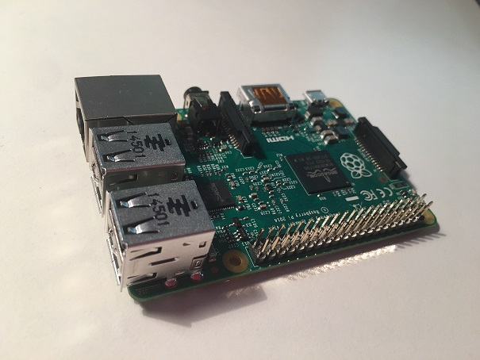
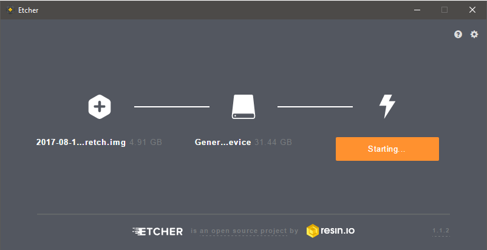
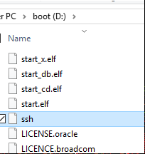
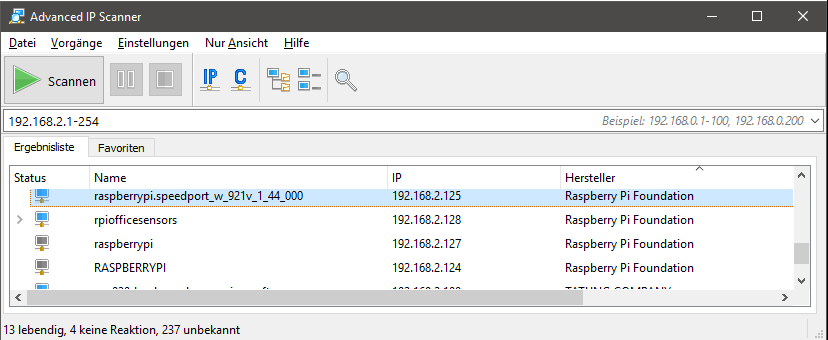
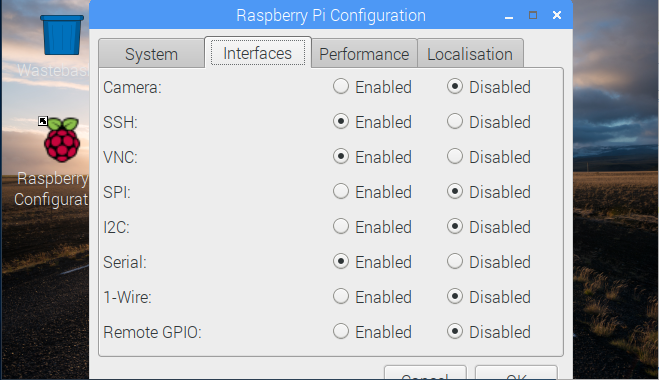
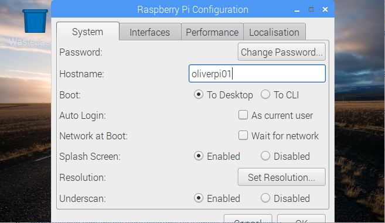

# Preparing your Raspberry Pi 2 (or 3) 

In this tutorial you will learn how to setup your Raspyberry Pi without keyboard, mouse, and monitor. 
Some of my other tutorials are based on this type of installation.



## Step 1: Download Raspbian Image

Please download the latest version of Raspbian Desktop from the following website: 
[https://www.raspberrypi.org/downloads/raspbian/](https://www.raspberrypi.org/downloads/raspbian/)

## Step 2: Download SD Card Tool Etcher

To flash the image to your local SD Card please use the Etcher Tool. 



You can download Etcher from this link: [https://etcher.io/](https://etcher.io/)

The steps in the tool are very simple:
1. Select image
2. Select SD Card
3. Start

## Step 3: Prepare headless access to the Raspberry PI

The headless installation reduce the need of connecting a keyboard or a monitor to the Raspberry Pi. This reduce the cost of hardware, and the cable chaos on your desk. To be able to connect to the Pi, you need SSH, which is disabled by default. To enable it before the first use of your SD Card. You just need to create an empty file in the root folder of the SD Card.



## Step 4: Start your Raspberry PI with the SD Card and find it on the network 

Now you can put the SD Card into your Pi. Please connect you Pi to your local area network with a cable to get a valid IP-Address. And don't forget to power on your device ;-)

To find the IP Address of your Raspberry Pi, you can use the [Advanced IP Scanner](http://www.advanced-ip-scanner.com/de/) to get a list of all "devices" in your network. 



## Step 5: Connect via ssh

I'm using [Putty](http://www.putty.org/) for ssh. With the IP-Address, Username pi and Password raspberry, you're ready to connect.

### Change Password is strongly recommended

Everyone knows the password of a new installed Raspberry Pi, so please changed it directly with the command:

``` 
$ passwd
```

## Step 6: Update to latest version of Raspbian

Maybe the image is a few days old. To get the latest and greatest version of Raspbian use the following commands: 

```
$ sudo apt-get update
$ sudo apt-get $ dist-upgrade
```

## Step 7: Configure access for remote desktop

To access your Raspberry via another computer over a remote desktop connection, you can use vnc (which is already installed in the Raspian Image). But before using it, you have to enable VNC via the Configuration of the "Interfaces".



After enabling VNC, a reboot is required.

Now you can access your Pi with the VNC Viewer from your local machine with the IP-Address you detected in Step 4. 

You can install the VNC Viewer from here: [https://www.realvnc.com/en/connect/download/viewer/](https://www.realvnc.com/en/connect/download/viewer/)

## Step 8: Create Hostname

For an easier access to your Pi, you should assign an unique hostname in the Pi Configuration Tool. Default hostname is Raspberry, which could be very confusing, if you have several Raspberry's in your network. 



A reboot is required after this step. 

## Step 9: Create a Share for your source

To access the Pi via a file share, you have to install Samba. To do so, open a terminal window and type: 

```
sudo apt install -y samba
```

To configure samba: 

```  
sudo leafpad /etc/samba/smb.conf &
``` 

First Change [global] section 
``` 
[global]
  workgroup = WORKGROUP
  wins support = yes
``` 

The configure file share:

``` 
[pishare]
  comment=pishare
  path=/home/pi/
  browseable=yes
  writeable=yes
  only guest=no
  create mask=0777
  directory mask=0777
  public=no
``` 

Save the file and exit. 

Now add user "Pi" to the share and set file share password:

```
sudo smbpasswd -a pi
```

Restart samba server:
``` 
service smbd restart
``` 

Now you should be able to access the Pi over a file share in your Windows Explorer. Enter the following url in the Windows Explorer address bar.
\\\\yourhostnamehere\pishare

If it doesn't work, try 
\\\\youripaddress\pishare

DNS on Windows needs sometimes a while

## Summary

Now you have a Raspberry Pi, which is ready to use with VNC and File Access with a share. This setup is used in the next tutorials.
